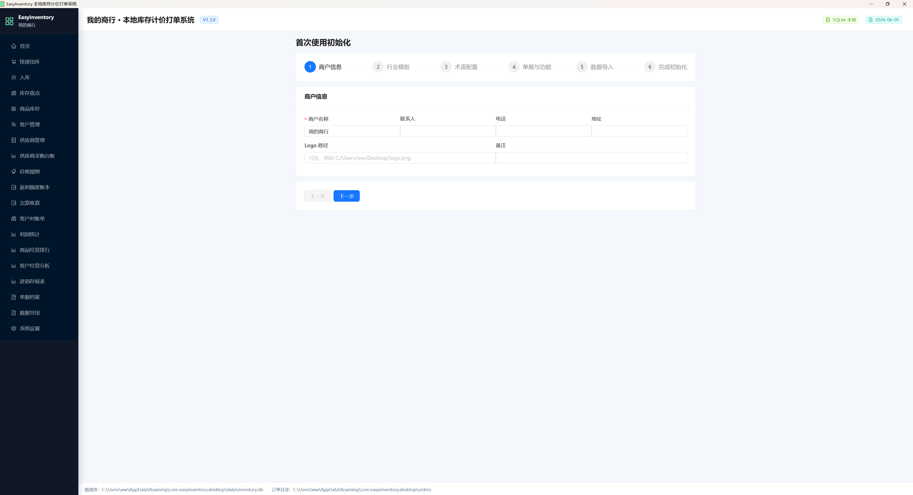
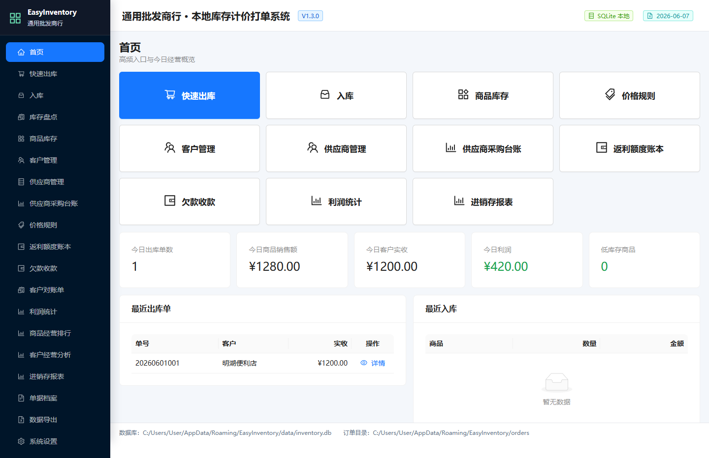
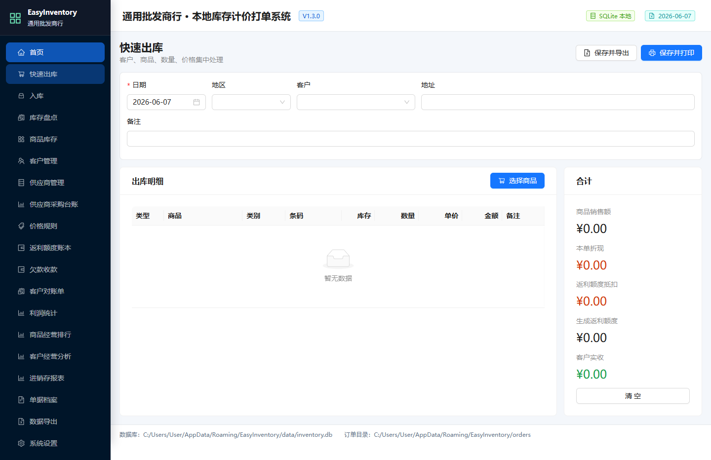
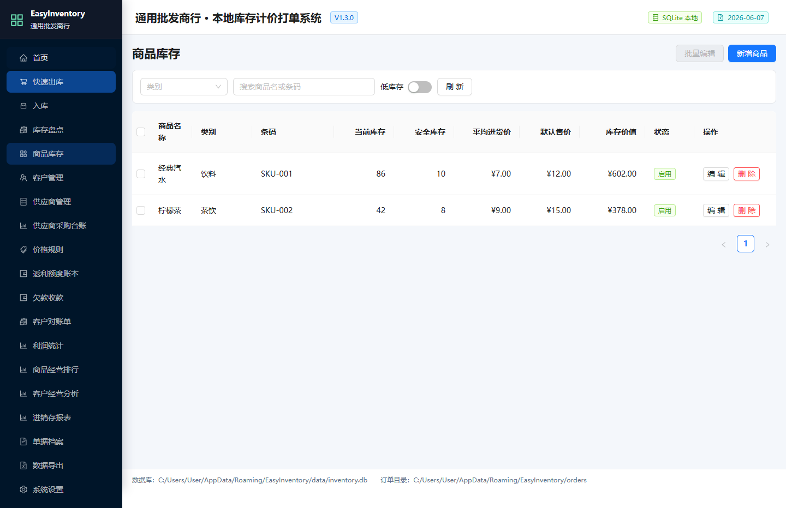
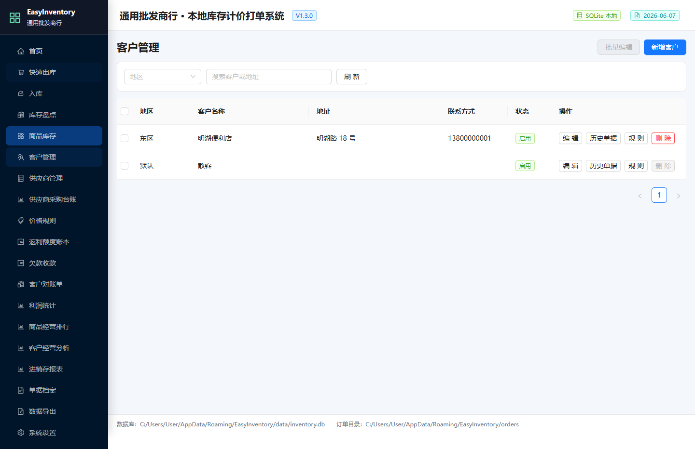
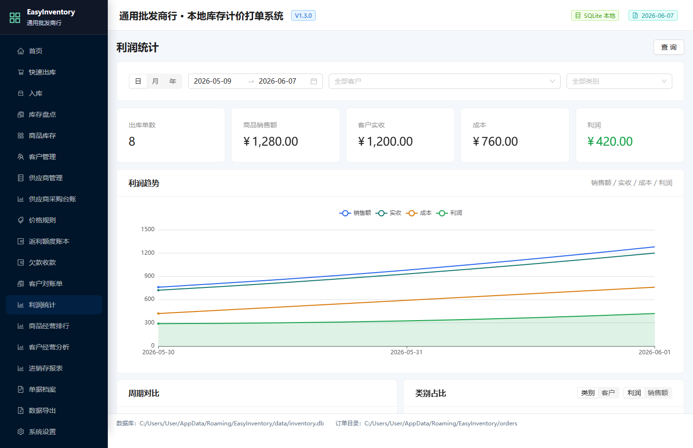
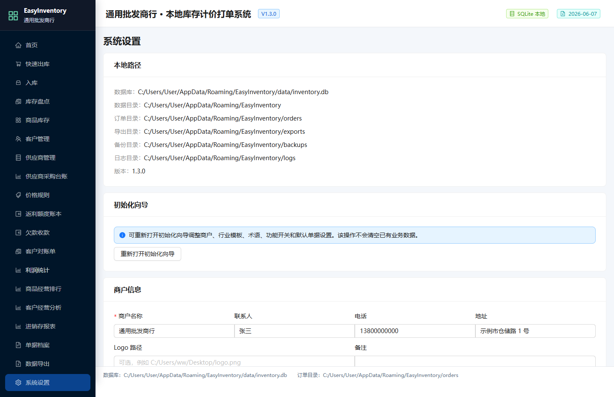

<p align="center">
  
</p>

<h1 align="center">EasyInventory</h1>

<p align="center">
  
  
  
  
  
  
</p>

<p align="center">
  Windows 本地库存、计价、出库打单与经营分析工具
</p>

EasyInventory 是一个轻量、本地化、开箱即用的 Windows 单机库存、计价、出库打单和经营分析软件，适合小型商贸、批发、配送、门店和档口经营场景。数据默认保存在本机 SQLite 数据库中，不依赖云服务，适合希望用简单工具替代复杂 Excel 工作簿的日常经营管理。

当前版本：`1.3.1`

## 软件截图

<p align="center">
  
</p>

<p align="center">
  
</p>

<p align="center">
  
</p>

<p align="center">
  
</p>

<p align="center">
  
</p>

<p align="center">
  
</p>

<p align="center">
  
</p>

## 适合谁

EasyInventory 适合单店、单仓、小团队使用，尤其适合仍在用 Excel 管理商品、库存、客户价、欠款和出库单的小型商贸场景。

适合：

- 小型批发、配送、门店、档口经营者。
- 需要本地保存数据、不想部署服务器的用户。
- 需要商品、客户、供应商、入库、出库、欠款、利润和打印单据的场景。
- 想学习或二次开发 Tauri、React、Rust、SQLite 桌面应用的开发者。

暂不适合：

- 多门店实时协作。
- 多人同时在线编辑。
- 完整财务总账、税务和银行对账。
- 大型 ERP、WMS 或云进销存平台替代。
- 强权限、多角色、多组织架构的大企业。

## 功能概览

- 本地 SQLite 数据库，支持自动备份、手动备份、恢复和诊断。
- 初始化向导支持商户信息、行业模板、业务术语、功能开关和单据模板配置。
- 商品、客户、供应商、入库、出库、库存余额、库存流水和库存盘点管理。
- 快速出库支持商品选择、扫码查询、客户价格规则、买赠、折现和额度抵扣。
- 欠款收款、客户对账单、供应商采购台账、进销存报表和利润统计。
- 商品经营排行、客户经营分析、日/月/年利润趋势、柱状图和占比图。
- 单据档案、打印预览、订单导出、PDF 导出和历史单据重新导出。
- 通用 Excel 导入支持商品、客户、期初库存、字段映射、预览确认和导入报告。
- 历史兼容迁移保留为高级入口，用于固定格式旧数据的一次性迁移。

## 技术栈

| 层级 | 技术 |
| --- | --- |
| 桌面壳 | Tauri 2 |
| 前端 | React 19、TypeScript、Vite、Ant Design、ECharts、React Router、Zustand、Day.js |
| 后端 | Rust、Tauri commands、rusqlite、calamine、umya-spreadsheet、chrono、serde |
| 数据库 | SQLite |
| 打包 | Windows release EXE 与 NSIS 安装包 |

## 运行时数据

应用运行时会在系统应用数据目录中维护业务数据，并创建以下子目录：

- `data`：SQLite 数据库。
- `backups`：数据库备份。
- `orders`：订单单据。
- `exports`：导出文件。
- `logs`：运行日志。
- `config`：本地配置。

这些路径可以在软件的系统设置页查看和打开。

## 快速下载安装

正式发布版本会在 GitHub Releases 页面提供 Windows 安装包：

- 当前版本下载页：[EasyInventory v1.3.1](https://github.com/weimanmk/EasyInventory/releases/tag/v1.3.1)。
- 下载 `EasyInventory_1.3.1_x64-setup.exe`。
- 安装前建议核对 Release 页面提供的 SHA256 校验值。
- 升级旧版本前，先在系统设置页执行一次手动备份。

当前开发树也可以本地打包：

```powershell
npm install
npm run release:verify
```

打包产物和 Release 清单默认位于：

```text
src-tauri/target/release/easyinventory.exe
src-tauri/target/release/bundle/nsis/EasyInventory_1.3.1_x64-setup.exe
release/EasyInventory_1.3.1_release_manifest.md
release/EasyInventory_1.3.1_github_release_notes.md
```

## 10 分钟快速试用

1. 启动软件，按初始化向导填写商户名称和基础模板。
2. 进入系统设置，使用“通用数据导入”下载商品模板。
3. 填入几条商品，导入并确认预览结果。
4. 新增一个客户和供应商。
5. 在入库页录入一笔入库，让商品产生库存。
6. 在快速出库页选择客户和商品，保存出库单。
7. 打开单据预览或导出单据。
8. 在系统设置页执行手动备份，确认备份文件已生成。

## 如何备份、恢复和迁移

- 自动备份：软件启动时会按设置执行每日自动备份。
- 手动备份：系统设置页可立即创建数据库备份。
- 恢复备份：恢复前会先创建当前数据库快照，降低误操作风险。
- 数据迁移：新用户优先使用“通用数据导入”；固定格式旧工作簿迁移位于高级历史兼容入口。
- 升级建议：安装新版本前先手动备份数据库，并保留旧安装包一段时间。

## 数据安全边界

- 数据默认保存在本机应用数据目录，不上传云端。
- 备份文件也保存在本机，用户需要自行决定是否复制到 U 盘、移动硬盘或私有网盘。
- 诊断包用于排查问题，导出前请确认其中不包含不希望公开的信息。
- 本项目不提供税务、审计、财务合规承诺；关键经营数据请按自己的业务要求额外备份。

## 开发环境

建议环境：

- Node.js 20 或更新版本。
- npm。
- Rust stable toolchain。
- Windows 上的 Tauri 构建依赖。

安装依赖：

```powershell
npm install
```

启动前端开发服务：

```powershell
npm run dev
```

启动 Tauri 开发模式：

```powershell
npm run tauri:dev
```

## 常用命令

```powershell
npm run typecheck
npm run build
npm run check
npm run tauri:build
npm run package:smoke
npm run release:manifest
npm run release:verify
```

命令说明：

- `npm run typecheck`：TypeScript 类型检查。
- `npm run build`：前端生产构建。
- `npm run check`：完整质量检查，包含前端构建、Rust 格式检查、clippy、Rust 测试、流程检查、浏览器 E2E 和健壮性检查。
- `npm run tauri:build`：构建 Windows release EXE 和 NSIS 安装包。
- `npm run package:smoke`：检查打包产物是否存在且非空。
- `npm run release:manifest`：生成 Release 清单、安装包大小、SHA256 校验值和 GitHub Release 正文。
- `npm run release:verify`：发布前完整验证、打包和清单生成。

发布到 GitHub Releases 前，按 [Release Checklist](docs/release-checklist.md) 复制版本说明、升级说明、已知问题和 SHA256 校验值。

## 数据导入

新用户建议优先使用系统设置页中的“通用数据导入”：

1. 选择导入类型。
2. 下载示例模板或选择已有 Excel 文件。
3. 根据预览结果确认新增、覆盖、跳过和异常行。
4. 确认写入后生成导入报告。

字段名称不一致时，可以通过字段映射方案适配现有 Excel 表头。高级历史兼容迁移入口只用于固定格式旧数据迁移，日常追加导入应使用通用数据导入。

## 目录结构

```text
.
├── src/                 # React 前端
├── src-tauri/           # Tauri/Rust 后端
├── scripts/             # 构建、验收和辅助脚本
├── tests/               # 浏览器 E2E 测试
├── docs/                # 项目文档
├── package.json
└── README.md
```

## 发布前检查

发布前建议执行：

```powershell
npm run release:verify
```

该命令会完成质量检查、Tauri 打包和安装包 smoke 检查。

## 常见问题

### 数据会上传到服务器吗？

不会。EasyInventory 默认使用本机 SQLite 数据库，数据保存在本机应用数据目录。

### 可以多人同时使用吗？

当前定位是 Windows 单机软件，不支持多人实时协作和多门店同步。

### 杀毒软件提示风险怎么办？

Tauri/NSIS 打包的本地工具在早期发布时可能遇到误报。建议从 GitHub Releases 下载正式版本，并核对 SHA256 校验值。

### Excel 表头和模板不一致怎么办？

优先使用通用导入的字段映射功能，将现有 Excel 表头映射到系统字段；导入前一定先看预览结果。

### 如何排查问题？

系统设置页提供日志目录、数据自检和诊断包导出。反馈问题时请优先附上版本号、复现步骤和脱敏后的诊断信息。

## 路线图

- 发布可信度：GitHub Actions、Release 说明、校验值、已知问题和升级说明。
- 安全收口：生产构建关闭 sourcemap、开启 minify、配置 CSP、治理 SQL 参数化和排序白名单。
- 后端架构：逐步拆分 command、service、repository、domain，降低巨石文件维护成本。
- 测试体系：补齐订单、库存、金额、作废、返利、导入和备份恢复的防回归测试。
- 前端结构：拆分 App、API、设置页和业务页面，改善二次开发体验。

## 贡献指南

欢迎提交 Issue 和 Pull Request。建议先阅读：

- [Contributing Guide](CONTRIBUTING.md)
- [Bug Report](.github/ISSUE_TEMPLATE/bug_report.md)
- [Feature Request](.github/ISSUE_TEMPLATE/feature_request.md)
- [Pull Request Template](.github/pull_request_template.md)

提交 PR 前建议至少运行：

```powershell
npm run typecheck
npm run build
npm run test:rust
npm run audit:robustness
```

## 许可证

本项目采用 `GNU Affero General Public License v3.0`（AGPLv3）。

你可以在 AGPLv3 条款下使用、复制、修改和分发本项目。若修改版本通过网络服务方式提供给用户，也需要按 AGPLv3 要求向用户提供对应源码。

完整条款见 [LICENSE](LICENSE)。
